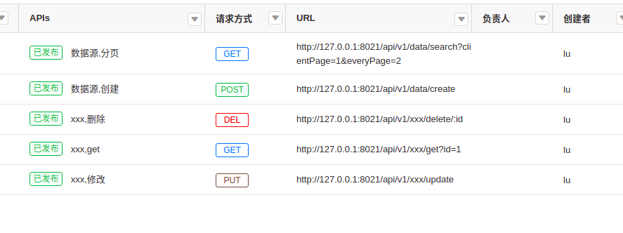

#### 公共约定

- 状态码  

1.200(创建/修改/删除)  
>历史遗留规范: 创建: 201, 修改: 206, 删除: 209  
```js
{
    "status": 200,
    "msg": "请求成功"
}
```
2.200(请求成功)
```js
{   
    "status":200,
    "msg":"请求成功",
    "data":{
         "id":1,
         "other":"other"
        }
    "pager":{
        "client_page":1,
        "every_page":10,
        "total_num":100
    }    
}
```
3.271(文字提示)
```js
{
    "status": 271,
    "msg": "用户已存在"
}
```
1.500(接口错误)  
```js
{
    "status": 500,
    "msg": "缺少token"
}
```

- eolinker  

状态如下:  
  

- 状态修改流程  
> 已发布/待定/对接  

1. 新接口(已发布)  
2. 前端调用后(待定)  
3. 对于(待定)的接口, 后端接口修改(对接),必须指明当前修改的字段  
  
前端调用,再次修改(待定)  
4. 全部状态为待定    

- 接口文档查看(关于crud):  
  
1.上图中关于crud,主要在于create/search方法,请求类型,POST/GET/DELETE/PUT参考文档  
2.create:包含完整的参数和参数类型  
3.update:create的基础上增加id,进行修改,修改的参数参考create,至少需要传递一个参数,除id外  
4.delete:通过id进行删除(eg:xx/delete/1,删除id=1)  
6.get(早期id):支持传递create参数请求,一般用来进行传id进行筛选,返回单个对象  
5.search:除create参数外,增加基本的clientPage(client_page)/everyPage(every_page)分页参数,返回数组对象  

> 关于search接口:默认支持order(排序),key(关键字,空格隔开)  
> 关于get/search: 默认支持mock(假数据)参数  