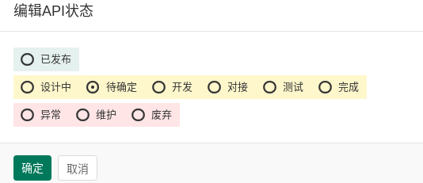

#### 公共约定

- 状态码  

1.200(创建/修改/删除)  
```js
{
    "status": 200,
    "msg": "请求成功"
}
```
2.200(请求成功)
```js
{   
    "status":200,
    "msg":"请求成功",
    "data":{
         "id":1,
         "other":"other"
        }
    pager:{
        client_page:1,
        every_page:10,
        total_num:100
    }    
}
```
3.271(文字提示)
```js
{
    "status": 271,
    "msg": "用户已存在"
}
```
1.500(接口错误)  
```js
{
    "status": 500,
    "msg": "缺少token"
}
```

- eolinker  

状态如下:  
  

- 状态修改流程  
> 已发布/待定/对接  

1. 新接口(已发布)
2. 前端调用后(待定)
3. 接口修改(对接)
4. 全部状态为待定